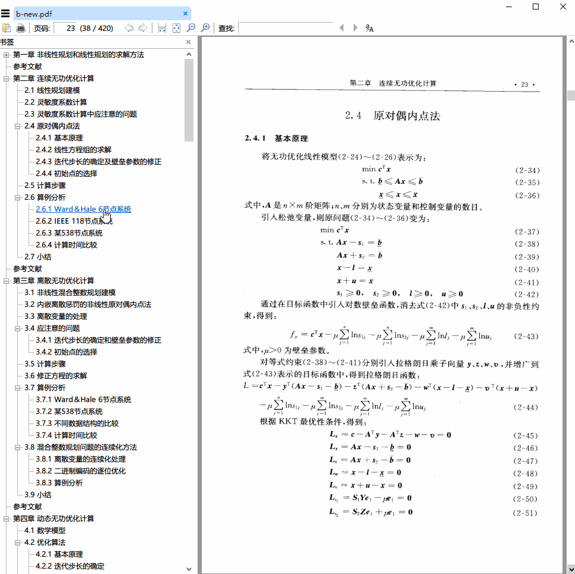

A minimal example of adding outlines to a PDF file from a provided toc text file
-----

### Prerequisite
1. Python v3.6- (Since v3.7, Python has changed StopIteration handling inside generators. See [PEP 479](https://www.python.org/dev/peps/pep-0479/) for more details.)
2. pip install PyPDF2
3. Hack the source file of PyPDF2 to fix <details><summary>this error:</summary><div>
    ```python
    Traceback (most recent call last):
      File ".\add_outline_to_pdf.py", line 70, in <module>
          print(addBookmark(args[1], args[2], int(args[3])))
      File ".\add_outline_to_pdf.py", line 56, in addOutline
          new_outline = writer.addBookmark(title, page + page_offset, parent=parent)
      File "C:\Anaconda3\lib\site-packages\PyPDF2\pdf.py", line 732, in addBookmark
          outlineRef = self.getOutlineRoot()
      File "C:\Anaconda3\lib\site-packages\PyPDF2\pdf.py", line 607, in getOutlineRoot
          idnum = self._objects.index(outline) + 1
    ValueError: {'/Type': '/Outlines', '/Count': 0} is not in list
    ```
    </div></details>

    Replace the `getOutlineRoot` method in `${PYTHON_PATH}/site-packages/PyPDF2/pdf.py` with the following:
    ```python
        def getOutlineRoot(self):
            if '/Outlines' in self._root_object:
                outline = self._root_object['/Outlines']
                if outline in self._objects:
                    idnum = self._objects.index(outline) + 1
                else:
                    # https://github.com/mstamy2/PyPDF2/issues/264
                    if not isinstance(outline, TreeObject):
                        def _walk(node):
                            node.__class__ = TreeObject
                            for child in node.children():
                                _walk(child)
                                if child not in self._objects:
                                    self._addObject(child)
                        _walk(outline)
                    outlineRef = self._addObject(outline)
                    self._root_object[NameObject('/Outlines')] = outlineRef
                    idnum = self._objects.index(outline) + 1
                outlineRef = IndirectObject(idnum, 0, self)
                assert outlineRef.getObject() == outline
            else:
                outline = TreeObject()
                outline.update({ })
                outlineRef = self._addObject(outline)
                self._root_object[NameObject('/Outlines')] = outlineRef

            return outline
    ```

### Steps
1. Copy [add_outline_to_pdf.py](https://github.com/Emrys365/code_examples/blob/master/PyPDF2/add_outline_to_pdf_from_toc_text/add_outline_to_pdf.py) to anywhere you like, say `${demo_dir}`
2. Prepare a PDF file to add outlines, say `${pdf_path}`
3. Prepare a toc text file, with the structure like:

    ```
    Introduction                            14
    I. Interview Questions                            99
        Data Structures                            100
        Chapter 1 | Arrays and Strings                            100
            Hash Tables                            100
            StringBuilder                            101
        Chapter 2 | Linked Lists                            104
            Creating a Linked List                            104
            The "Runner" Technique                            105
        Additional Review Problems                            193
    ```

    You can add as many spaces as you like in each line.

    The last field in each line must be the page number corresponding to the outline item in that line.

    Different outline levels will be automatically determined by their indent (number of leading spaces). 
4. Run the following command to add the outline in `${outline_txt}` to `${pdf_path}` (a new PDF file will be created):
    ```bash
    python ${demo_dir}/add_outline_to_pdf.py ${pdf_path} ${outline_txt} ${page_offset}
    ```

    `${page_offset}` is used to shift all page numbers in `${outline_txt}` by a fixed number (can be negative). If no shift is needed, you can simply pass `0`.

    Below is a demo of the generated PDF file.
    
